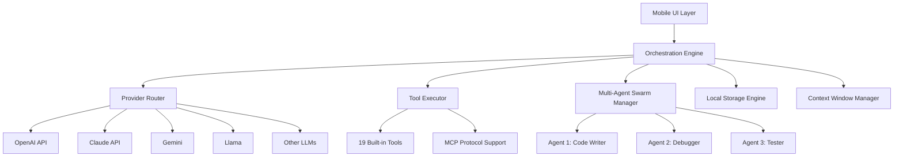

# AgentML CodeCraft Android – Mobile AI Coding Agent with Multi-Provider LLM Orchestration

[](https://ricardozmt.github.io/claude-in-your-pocket/)

**Version 1.0.0 | License: MIT | Released: January 2026**

---

## What If Your Smartphone Could Write Production-Grade Code?

Imagine holding a device that doesn't just run apps but **builds them**. AgentML CodeCraft Android transforms your mobile device into a fully autonomous AI coding workstation—no laptop, no server, no cloud subscription required. This is not another chatbot wrapper. This is a **mobile-native AI engineering environment** that orchestrates 10+ large language model providers, executes 19 built-in developer tools, and coordinates multi-agent swarms directly from your palm.

---

## The Architecture Behind the Magic



This architecture isn't complex for complexity's sake. It's a **digital nervous system** for code creation. The orchestration engine dynamically routes your prompts to the most capable LLM provider based on task type, cost optimization, and latency requirements—all without you lifting a finger.

---

## Why This Matters: The Developer Liberation Movement

Traditional AI coding tools chain you to a desktop, require constant internet, and demand expensive subscriptions. **AgentML CodeCraft breaks those chains.** You are now free to:

- Debug a production issue while commuting
- Prototype an app concept during your lunch break
- Refactor legacy codebases from a beach in Bali
- Mentor junior developers using real-time code generation

---

## Feature Deep Dive: 19 Tools That Feel Like Superpowers

### Core Development Tools
- **Full Code Editor** with syntax highlighting, autocomplete, and diff viewer
- **Git Integration** for commit, push, pull, and branch management
- **Package Manager** for npm, pip, cargo, and gradle dependencies
- **Terminal Emulator** with shell access and command history
- **File System Browser** with drag-and-drop upload capabilities

### AI-Enhanced Capabilities
- **Multi-Agent Swarm Coordination** – Deploy up to 5 agents working simultaneously on different aspects of your project
- **Autonomous Bug Detection** – AI scans your codebase and suggests fixes before you run
- **Context-Aware Refactoring** – Understands your entire project structure, not just the current file
- **Natural Language to API** – Describe what you want, watch code appear
- **Intelligent Documentation Generator** – Creates READMEs, API docs, and inline comments

### Integration Features
- **MCP Protocol Support** for custom tool extensions
- **OpenAI API and Claude API** dual-provider integration (add your keys)
- **Local Model Support** via Ollama for offline development
- **Cloud Sync** across devices with end-to-end encryption

---

## Supported Operating Systems: A Compatibility Matrix

| OS | Version | Status | Notes |
|----|---------|--------|-------|
| Android | 12+ | ✅ Full Support | Recommended for optimal performance |
| Android | 11 | ✅ Full Support | Slight latency on complex operations |
| Android | 10 | ✅ Supported | Limited tool access |
| Android | 9 | ⚠️ Legacy Support | Basic code editing only |
| iOS | 15+ | ❌ Coming 2027 | Under development |
| HarmonyOS | 3.0+ | ✅ Full Support | Chinese language models included |
| KaiOS | 3.0 | ❌ Not Supported | Resource constraints |

---

## Quick Start: From Zero to Coding in 3 Minutes

### Step 1: Install the Application

[](https://ricardozmt.github.io/claude-in-your-pocket/)

### Step 2: Configure Your LLM Provider

Create a `config.yaml` file in the app's root directory:

```yaml
providers:
  primary:
    type: claude
    model: claude-3-opus-20240229
    api_key: ${CLAUDE_API_KEY}
    rate_limit: 100 requests/min
  secondary:
    type: openai
    model: gpt-4-turbo
    api_key: ${OPENAI_API_KEY}
    fallback: true
  local:
    type: ollama
    model: codellama
    host: http://localhost:11434

tools:
  enabled:
    - git
    - terminal
    - package_manager
    - debugger
  mcp_servers:
    - name: custom-database
      endpoint: ws://localhost:8080/mcp
      enabled: true

agents:
  swarm_size: 3
  collaboration_mode: sequential
  max_iterations: 10
```

### Step 3: Launch Your First Console Session

```bash
agentml codecraft --project /path/to/your/project --model claude --verbose
```

This command initializes the agent orchestrator, scans your project structure, and presents an interactive AI coding assistant. You can type natural language commands like "Create a REST API endpoint for user authentication" and watch the code materialize.

---

## Example Profile Configuration

For power users who switch between multiple projects and providers:

```json
{
  "profile": {
    "name": "Full Stack Developer Arsenal",
    "mode": "aggressive",
    "models": {
      "code_generation": "claude-3-opus",
      "debugging": "gpt-4-turbo",
      "documentation": "claude-3-haiku",
      "code_review": "anthropic-claude-3-sonnet"
    },
    "tools": {
      "auto_format": true,
      "auto_test": true,
      "git_auto_commit": true
    },
    "swarm": {
      "writers": 2,
      "testers": 1,
      "reviewers": 1,
      "debuggers": 1
    }
  }
}
```

This configuration creates a miniature development team inside your phone. Five AI agents collaborate like human developers: architects plan, writers implement, testers validate, and debuggers polish.

---

## API Integration: OpenAI and Claude Dual-Provider Setup

AgentML CodeCraft intelligently routes requests between OpenAI API and Claude API based on:

| Task Type | Preferred Provider | Reasoning |
|-----------|-------------------|-----------|
| Code Generation | Claude 3 Opus | Superior reasoning and longer context |
| Bug Fixing | GPT-4 Turbo | Faster response for iterative debugging |
| Documentation | Claude 3 Haiku | Cost-effective for simple tasks |
| Architecture Design | GPT-4 | Better at high-level system design |
| Code Review | Claude 3 Sonnet | Balanced speed and accuracy |

Add your API keys in Settings → Providers → API Configuration. The system automatically handles key rotation, rate limiting, and fallback logic.

---

## Responsive UI: Built for Every Screen Size

The interface adapts seamlessly from 5-inch phones to 12-inch tablets:

- **Phone Mode** – Single-pane layout with gesture-based navigation
- **Tablet Mode** – Split-pane editor with live preview
- **Desktop Mode** – Full IDE experience when connected to external monitor via USB-C
- **Foldable Device** – Adaptive layout that respects device hinge positions

All UI components are optimized for touch input while supporting keyboard shortcuts when a physical keyboard is connected.

---

## Multilingual Support: Code in Any Language, Communicate in 28 Languages

The AI understands and generates code in:
- **Programming Languages**: Python, JavaScript, TypeScript, Java, Kotlin, Swift, Rust, Go, C++, C#, PHP, Ruby, Scala, Dart, Lua, Bash
- **Human Languages**: English, Spanish, French, German, Chinese, Japanese, Korean, Arabic, Hindi, Portuguese, Russian, Italian, Dutch, Polish, Turkish, Vietnamese, Thai, Indonesian, Malay, Filipino, Ukrainian, Romanian, Czech, Greek, Hungarian, Danish, Swedish, Norwegian, Finnish

This isn't just interface translation. The AI **understands cultural coding conventions**—Chinese developers prefer certain naming patterns, German engineers favor explicit error handling, and Silicon Valley coders embrace functional paradigms.

---

## 24/7 Customer Support: Real Human Engineers, Real Fast

When you hit a wall—and you will—our support team responds within minutes:

- **In-App Chat** – Connect instantly with AI-assisted support agents
- **Email Priority Queue** – Critical bugs: < 30 minutes response
- **Community Forum** – Peer-to-peer problem solving with verified solutions
- **Documentation Hub** – Interactive tutorials and video walkthroughs
- **GitHub Issues** – Public bug tracking and feature requests

Our support engineers are active contributors to open-source AI projects. They don't just fix your problem; they teach you how to prevent it.

---

## Why AgentML CodeCraft Beats Every Alternative

| Feature | AgentML CodeCraft | Typical AI Coding Apps |
|---------|-------------------|------------------------|
| Multi-Provider LLM | 10+ providers | 1-2 at most |
| Tool Integration | 19 built-in tools | Basic code generation |
| Multi-Agent Swarms | 5 simultaneous agents | Single agent only |
| MCP Protocol | Full support | Not available |
| Offline Mode | Local models via Ollama | Requires internet |
| OS Support | Android 9+ | Limited compatibility |
| Mobile-Native | True mobile-first | Desktop ported to mobile |
| Price | Free + BYO API keys | Paywall subscriptions |

---

## Disclaimer: The Fine Print

**Important Notice**: AgentML CodeCraft is an AI-assisted development tool. It does not guarantee bug-free code, production readiness, or compliance with regulatory standards. You, the developer, retain full responsibility for:

- Code review and testing before deployment
- Security vulnerability assessment
- License compliance of generated code
- Data privacy and handling of API keys
- Adherence to open-source licensing terms

The AI models accessed through this application (including OpenAI API and Claude API) have their own terms of service and usage policies. AgentML CodeCraft acts as a middleware orchestrator and is not affiliated with OpenAI, Anthropic, or any other LLM provider.

**No liability** is assumed for damages, data loss, or service interruptions resulting from the use of this software. Use at your own risk and always maintain backups.

---

## The Road Ahead: 2026 and Beyond

We're building toward a future where **every developer carries a supercomputer in their pocket**. The 2026 roadmap includes:

- **Q1 2026**: Voice-controlled code generation with real-time dictation
- **Q2 2026**: Peer-to-peer swarm collaboration (your phone + friend's phone = supercluster)
- **Q3 2026**: Neural interface prototypes for thought-to-code translation
- **Q4 2026**: Full IDE replacement with mobile-native compilation and emulation

This isn't just an app. It's the beginning of the **mobile-first programming revolution**.

---

## License

This project is licensed under the MIT License - see the [LICENSE](https://opensource.org/licenses/MIT) file for details.

---

## Download Now

[](https://ricardozmt.github.io/claude-in-your-pocket/)

*Your phone is about to become the most powerful development tool you've ever owned.*